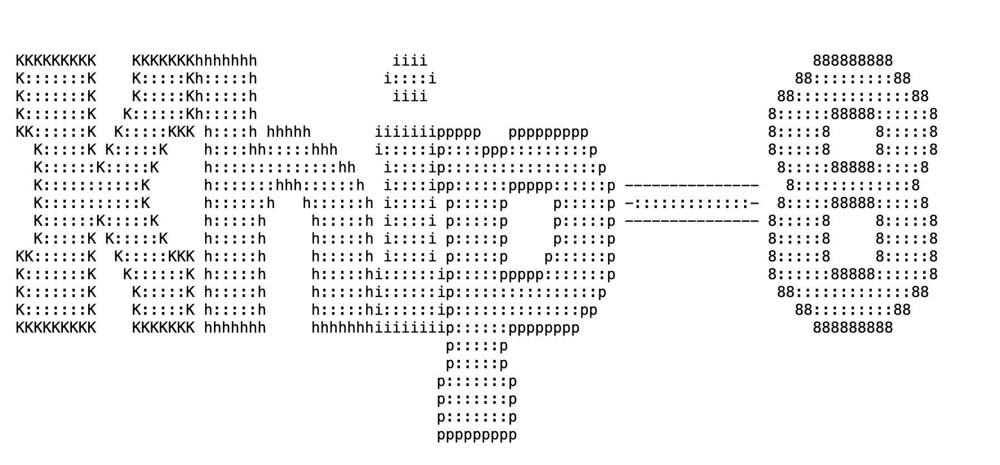

# Khip-8

  

## Installation

Set the ROM path in the `MainActivity.kt` file. Then press Run in IDEA.
    
## Screenshots

## FAQ

#### What are the keybinds?

1-9, 0, A, B, C, D, E, F

#### Why is the emulator slow?

Try giving the emulator access to your dedicated GPU.
## Tech Stack

**Kotlin**
**IntelliJ IDEA**
**OPENRNDR**

## Contributing

Contributions are always welcome!

To setup the project, just open it in IntelliJ IDEA.

## License

[MIT](https://choosealicense.com/licenses/mit/)

